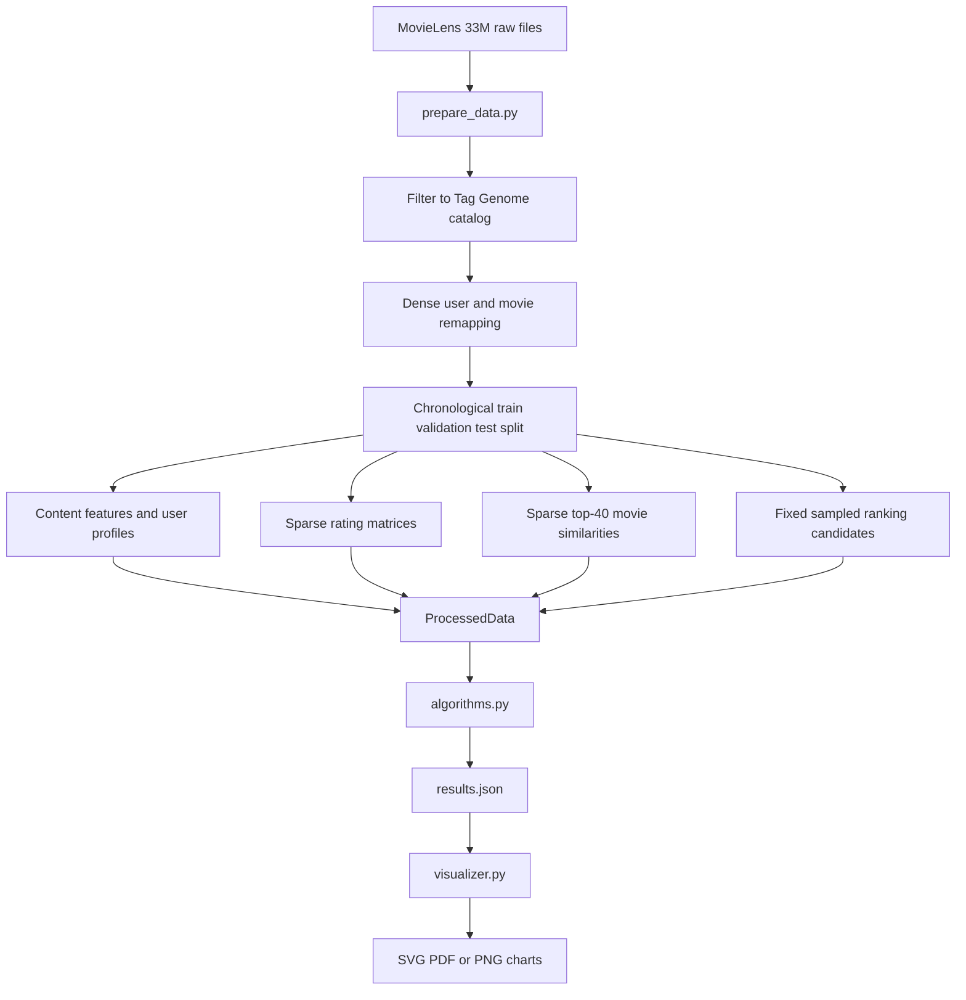

## ReRecom architecture

ReRecom is a MovieLens 33M recommender-system experiment comparing nine
methods across rating-prediction and ranking objectives.

The central experimental question is whether the optimized objective,
particularly pointwise rating error versus pairwise or top-N ranking quality,
matters more than nominal model complexity.

## Current source of truth

The current implementation is defined by:

- `prepare_data.py`
- `algorithms.py`
- `SCIENTIFIC_IMPLEMENTATION_REPORT.md`

This architecture document describes those versions. Processed artifacts
created by older versions of the pipeline are incompatible and must be
regenerated.

## Dependencies

- Python 3.10 or later
- NumPy
- SciPy
- Matplotlib for `visualizer.py`

Matplotlib uses the noninteractive `Agg` backend, so chart generation does not
require a graphical display.

## Repository layout

```text
ReRecom/
├── RawData/
│   └── 33M-grouplens/
│       ├── ratings.csv
│       ├── movies.csv
│       ├── genome-tags.csv
│       └── genome-scores.csv
├── ProcessedData/
│   ├── interactions_train.npy
│   ├── interactions_validation.npy
│   ├── interactions_test.npy
│   ├── external_user_ids.npy
│   ├── external_movie_ids.npy
│   ├── genre_vectors_norm.npy
│   ├── genome_scores_norm.npy
│   ├── user_genre_profiles.npy
│   ├── user_genome_profiles.npy
│   ├── user_mean_ratings.npy
│   ├── movie_mean_ratings.npy
│   ├── user_seen_train.npy
│   ├── movie_seen_train.npy
│   ├── ratings_train_csr.npz
│   ├── ratings_train_csc.npz
│   ├── item_similarity_top40.npz
│   ├── ranking_validation_1000.npz
│   ├── ranking_test_1000.npz
│   ├── metadata.npz
│   └── results.json
├── Predictions/
│   ├── global_mean_predictions.npy
│   ├── genre_content_predictions.npy
│   ├── genome_content_predictions.npy
│   ├── hybrid_predictions.npy
│   ├── user_knn_predictions.npy
│   ├── movie_knn_predictions.npy
│   ├── mf_predictions.npy
│   └── bpr_predictions.npy
├── charts/
├── prepare_data.py
├── algorithms.py
├── visualizer.py
├── SCIENTIFIC_IMPLEMENTATION_REPORT.md
└── ARCHITECTURE.md
```

`ProcessedData/`, `Predictions/`, and `charts/` are generated directories.

## Execution order

Run the complete experiment from the repository root:

```bash
python prepare_data.py
python algorithms.py
python visualizer.py
```

Alternative visualizer output formats are:

```bash
python visualizer.py ProcessedData svg
python visualizer.py ProcessedData pdf
python visualizer.py ProcessedData png
```

If `ProcessedData/results.json` is absent, `visualizer.py` can run
`algorithms.py` automatically. All other processed artifacts must already
exist.

## End-to-end flow



## Data preparation

## Configuration

| Constant | Default | Purpose |
|---|---:|---|
| `NUM_TAGS` | 1128 | Expected Tag Genome dimension |
| `MIN_USER_INTERACTIONS` | 5 | Minimum retained interactions per user |
| `RAW_DATA_DIR` | `RawData/33M-grouplens` | Raw MovieLens input |
| `OUTPUT_DIR` | `ProcessedData` | Processed artifact directory |
| `PREDICTIONS_DIR` | `Predictions` | Prediction array output directory |
| `RELEVANCE_THRESHOLD` | 3.5 | Minimum relevant held-out rating |
| `RANKING_USERS` | 500 | Maximum evaluation users per ranking split |
| `RANKING_CANDIDATES` | 1000 | One positive plus 999 negatives |
| `MOVIE_NEIGHBORS` | 40 | Stored neighbors per target movie |
| `MIN_COMMON_RATERS` | 2 | Minimum movie-pair support |
| `SIMILARITY_SHRINKAGE` | 10.0 | Movie-similarity support shrinkage |
| `ITEM_SIMILARITY_BLOCK_SIZE` | 64 | Movie-similarity computation block size |
| `PARALLEL_WORKERS` | automatic | Process-worker count; 1 forces serial |

The default `sample_size=None` and `offset=0` process the complete
`ratings.csv` file. `prepare_data.py` parallelizes raw-file loading,
content-profile accumulation, movie-similarity blocks, and ranking
candidate construction in forked worker processes. Content profiles are
split into contiguous user blocks so each 50 000-row chunk is processed
independently and the resulting float32 heaps are assembled in user order,
keeping accumulation bit-identical to the serial pipeline. Results are
identical to the serial pipeline; set `PARALLEL_WORKERS = 1` to force the
serial code path.

Finite samples and offsets are supported for development runs, but they are
not random MovieLens samples and must not be presented as the full study.

## Catalog restriction

The experiment retains only movies with MovieLens Tag Genome features.

This provides one common movie domain for all nine methods. It also means the
study is not a full-catalog MovieLens 33M experiment.

After catalog filtering:

- Users with fewer than five retained interactions are removed.
- External user and movie IDs are remapped to dense zero-based indices.
- Duplicate user-movie interactions cause preparation to fail.

## Chronological split

Interactions are ordered by timestamp within each user:

- Latest interaction: test.
- Second-latest interaction: validation.
- All earlier interactions: training.

Every retained user therefore has at least three training interactions and
one interaction in each held-out split.

Equal timestamps are ordered by original `ratings.csv` row order. This
deterministic tie-break does not imply that the corresponding ratings
occurred in that order.

The validation set is shared across algorithms. Validation interactions are
never used as base model-fitting interactions, but the validation set is
used for model selection and predictive calibration, including content-scale
fitting, hybrid blend selection, regularization selection, and the BPR
post-hoc rating mapping.

## Content features

### Genre features

Each movie receives a 20-dimensional multi-hot vector covering the MovieLens
genres, including `(no genres listed)`.

Rows are L2-normalized and saved as:

```text
genre_vectors_norm.npy
```

### Tag Genome features

Each movie receives a 1128-dimensional vector of Tag Genome relevance values.

Rows are L2-normalized and saved as:

```text
genome_scores_norm.npy
```

Both feature matrices are aligned to the dense experiment movie indices.

## Residual-weighted user profiles

Genre and Tag Genome profiles are constructed from training interactions:

$$
p_u=
\operatorname{normalize}
\left(
\sum_{i\in I_u}
(r_{ui}-\bar r_u)x_i
\right).
$$

The generated files are:

```text
user_genre_profiles.npy
user_genome_profiles.npy
```

These are signed residual-weighted profiles, not raw-rating weighted averages.

## Rating statistics

`prepare_data.py` calculates from training data:

- Global mean.
- User means.
- Movie means.
- User training-presence mask.
- Movie training-presence mask.

Unseen entities receive the global mean in their corresponding mean array.

## Sparse interaction matrices

Training ratings are saved in both formats:

- CSR for efficient user-history access.
- CSC for efficient movie co-rater access.

The artifacts are:

```text
ratings_train_csr.npz
ratings_train_csc.npz
```

## Movie-movie similarity

Movie-based collaborative filtering uses adjusted cosine similarity over
pair-specific co-raters.

The preparation pipeline applies:

- Minimum support of two co-raters.
- Support shrinkage of 10.
- Retention of signed similarities.
- Selection by largest absolute similarity.
- A maximum of 40 stored neighbors per target movie.
- Block-wise calculation to avoid a dense full-catalog similarity matrix.

The resulting sparse matrix is:

```text
item_similarity_top40.npz
```

## Ranking candidate generation

Separate validation and test candidate files are created:

```text
ranking_validation_1000.npz
ranking_test_1000.npz
```

Each evaluated row contains:

- One relevant held-out movie with rating at least 3.5.
- 999 distinct uniformly sampled negatives.
- The index of the positive movie after candidate shuffling.

Candidate movies must occur in training. Negatives are absent from all known
interactions for the user across training, validation, and test. This
all-known-movie exclusion uses held-out-period information: when validation
candidates are constructed, each user's chronologically later test
interaction is already known and excluded from the validation negatives.
The leakage is limited to candidate-set construction; no test labels enter
model fitting, model selection, or score calibration.

The candidate sets use fixed seeds:

- Validation: 2025.
- Test: 2026.

At most 500 eligible users are retained for each split.

This follows the general one-plus-sampled-negatives evaluation pattern
associated with Cremonesi et al., but it is not an exact reproduction.
Following the concerns established by Krichene and Rendle, the resulting
metrics are interpreted only for these fixed candidate sets and are not
treated as full-catalog estimates.

## Processed artifacts

| File | Content |
|---|---|
| `interactions_train.npy` | Training rows `[user, movie, rating]` |
| `interactions_validation.npy` | Validation rows `[user, movie, rating]` |
| `interactions_test.npy` | Test rows `[user, movie, rating]` |
| `external_user_ids.npy` | Dense-index to MovieLens user ID mapping |
| `external_movie_ids.npy` | Dense-index to MovieLens movie ID mapping |
| `genre_vectors_norm.npy` | Normalized 20-dimensional genre vectors |
| `genome_scores_norm.npy` | Normalized 1128-dimensional genome vectors |
| `user_genre_profiles.npy` | Normalized residual-weighted genre profiles |
| `user_genome_profiles.npy` | Normalized residual-weighted genome profiles |
| `user_mean_ratings.npy` | Training user means |
| `movie_mean_ratings.npy` | Training movie means |
| `user_seen_train.npy` | User training-presence mask |
| `movie_seen_train.npy` | Movie training-presence mask |
| `ratings_train_csr.npz` | CSR training-rating matrix |
| `ratings_train_csc.npz` | CSC training-rating matrix |
| `item_similarity_top40.npz` | Sparse adjusted-cosine movie neighbors |
| `ranking_validation_1000.npz` | Fixed validation ranking candidates |
| `ranking_test_1000.npz` | Fixed test ranking candidates |
| `metadata.npz` | Dataset sizes, means, and preparation settings |

Artifacts from the previous random-split, dense-similarity, BPR-triplet, or
calibration-split pipeline are no longer used.

In particular, the current pipeline does not generate:

- `movie_similarity.npy`
- `user_similarity_500.npy`
- `movie_interactions.npy`
- `user_interactions.npy`
- `bpr_triplets.npz`
- `bpr_calibration.npy`
- `ranking_candidates_1000.npz`
- `user_genre_weighted.npy`
- `user_genome_weighted.npy`

## Data loading API

`prepare_data.py` exposes:

```python
load_arrays(path=OUTPUT_DIR)
```

The returned dictionary contains:

- `train`
- `validation`
- `test`
- `genre_vectors`
- `genome_vectors`
- `genre_profiles`
- `genome_profiles`
- `user_means`
- `movie_means`
- `user_seen`
- `movie_seen`
- `ratings_csr`
- `ratings_csc`
- `movie_similarity`
- `metadata`

Ranking candidates are loaded separately:

```python
load_ranking("validation", path=OUTPUT_DIR)
load_ranking("test", path=OUTPUT_DIR)
```

## Algorithm runner

`algorithms.py` implements nine methods.

| # | Result name | Family | Current implementation |
|---|---|---|---|
| 1 | Global mean | Baseline | Training global mean |
| 2 | Genre content profile | Content | Residual-weighted normalized genre profile |
| 3 | Tag Genome content profile | Content | Residual-weighted normalized genome profile |
| 4 | Tag Genome weighted hybrid | Ensemble | Confidence-weighted blend of Tag Genome content and User-based k-NN |
| 5 | User-based k-NN | Neighborhood CF | Shrunk mean-centered cosine |
| 6 | Movie-based k-NN | Neighborhood CF | Sparse shrunk adjusted cosine |
| 7 | Biased MF | Latent factor | Bias-aware pointwise SGD |
| 8 | BPR-MF thresholded positives | Latent factor | Explicit-feedback BPR adaptation |
| 9 | MF+BPR hybrid | Hybrid | Dual-headed blend of Biased MF and BPR-MF (rating head on raw ratings, ranking head on per-row z-scores) |

Detailed formulas, deviations, and citations are documented in:

- `SCIENTIFIC_IMPLEMENTATION_REPORT.md`

## Shared evaluation

### Rating metrics

`rating_metrics()` rejects non-finite predictions and reports raw metrics:

- `rmse`
- `mae`
- `bias`

It also clips predictions to the valid range $[0.5,5.0]$ and reports
separately named bounded metrics:

- `bounded_rmse`
- `bounded_mae`
- `bounded_bias`

Additional diagnostic fields are:

- `n_out_of_range`
- `out_of_range_pct`
- `n_non_finite`
- `n_total`

Raw metrics are primary. Bounded metrics are not substituted silently.

There is no variable prediction coverage in the current evaluation:
non-finite predictions cause evaluation to fail instead of being omitted.

### Ranking metrics

`ranking_metrics()` evaluates every algorithm against the same fixed test
candidate rows.

It reports only the nonredundant one-positive measures:

- `hit_rate@k`
- `ndcg@k`
- `mrr@k`
- `n_evaluated`
- `n_candidates`
- `k`

With one relevant movie:

- Recall at K equals Hit Rate at K.
- Precision at K equals Hit Rate at K divided by K.
- AP at K equals truncated reciprocal rank at K.

Precision, recall, and MAP are therefore not stored separately.

Stable descending sorting provides deterministic candidate-order
tie-breaking. The global-mean baseline is an exception: it uses explicit
seeded random scores because all of its rating scores are equal.

## Validation use

The common validation set is used for:

- Nonnegative content-scale fitting.
- Hybrid blend-weight selection.
- Matrix-factorization regularization selection.
- BPR regularization selection through fixed validation NDCG@10.
- BPR post-hoc affine rating mapping.

Validation interactions are not added to the model-fitting data.

## Algorithm-specific configuration

| Constant | Value |
|---|---:|
| `K` | 10 |
| `RATING_BOUNDS` | `(0.5, 5.0)` |
| `USER_NEIGHBORS` | 40 |
| `MIN_COMMON_ITEMS` | 2 |
| `USER_SIMILARITY_SHRINKAGE` | 10.0 |
| `BPR_RELEVANCE_THRESHOLD` | 3.5 |
| `BPR_NEGATIVES_PER_POSITIVE` | 4 |
| `BPR_SELECTION_TOLERANCE` | $10^{-12}$ | NDCG tie tolerance for BPR selection |
| `MF_REGULARIZATION_GRID` | `(0.02, 0.05)` |
| `BPR_REGULARIZATION_GRID` | `(0.0025, 0.01)` |
| `HYBRID_ALPHA_GRID` | 0.0 through 1.0 in steps of 0.1 |

## Content models

Both content models predict:

$$
\hat r_{ui}
=
\bar r_u+\beta p_u^\mathsf{T}x_i,
\qquad \beta\geq0.
$$

The shared validation set fits $\beta$ by nonnegative least squares.

The current implementation does not use the old fixed mapping:

$$
2.75+2.25\operatorname{similarity}.
$$

Predictions are not clipped inside the model.

## Tag Genome weighted hybrid

The hybrid is a confidence-weighted ensemble of the two already-evaluated
methods, the Tag Genome content profile (algorithm 3) and the User-based
k-NN (algorithm 5). It reuses their saved outputs rather than inventing a new
collaborative signal. For each row it has:

- the content prediction $\hat r_{ui}^{\mathrm{content}} = \bar r_u + \beta\, p_u^\top x_i$,
- the k-NN prediction $\hat r_{ui}^{\mathrm{knn}}$,
- the number $n_{ui}$ of usable k-NN neighbours actually used (after the
  top-$k$ selection); $n_{ui}=0$ exactly when the k-NN fell back to the movie
  mean $\bar r_i$ because it had no usable evidence.

The prediction is a convex blend where the k-NN has evidence, and content
alone where it does not:

$$
\hat r_{ui}^{\mathrm{hyb}}
=
\begin{cases}
\alpha\,\hat r_{ui}^{\mathrm{content}} + (1-\alpha)\,\hat r_{ui}^{\mathrm{knn}}
& \text{if } n_{ui} > 0, \\
\hat r_{ui}^{\mathrm{content}}
& \text{if } n_{ui} = 0.
\end{cases}
$$

The content-only fallback is what lets the ensemble weakly dominate the plain
k-NN parent: on rows where the k-NN degrades to a crude movie mean, the
content signal carries the prediction instead. The blend weight $\alpha$ is
selected on the shared validation set by minimising validation RMSE over
`HYBRID_ALPHA_GRID` ($0.0$ through $1.0$ in steps of $0.1$, first grid point
wins ties); the confidence rule is applied inside the grid search so
zero-neighbour rows (which contribute content for every $\alpha$) do not bias
the selection.

The hybrid reuses the saved test-row outputs of the `genome_content` and
`user_knn` stages, so those stages must run first. The `user_knn` stage
additionally saves the per-row usable-neighbour count in
`Predictions/user_knn_counts.npy`. The hybrid's reported training time
includes the content-scale fit and the $\alpha$ selection.

For ranking, candidates are warm-start training-catalog movies, so the k-NN
count is always $>0$ and every candidate uses the convex blend; the
content-only fallback applies only to rating rows.

## User-based k-NN

User similarity is calculated on demand over common training movies.

The implementation uses:

- Mean-centered cosine.
- At least two common movies.
- Support shrinkage of 10.
- Up to 40 largest absolute similarities.
- Signed similarities.
- Absolute-similarity normalization.
- Movie-mean fallback.

Computed similarities are cached for reuse.

## Movie-based k-NN

The algorithm consumes the sparse top-40 movie-similarity matrix created by
`prepare_data.py`.

Prediction uses signed similarity-weighted raw ratings divided by the sum of
absolute similarities. Missing neighborhoods fall back to the movie mean.

## Biased matrix factorization

The model is:

$$
\hat r_{ui}
=
\mu+b_u+b_i+p_u^\mathsf{T}q_i.
$$

Current fixed settings are:

- 50 factors.
- Learning rate 0.005.
- 20 epochs.
- Validation-selected regularization.

The reported training time includes training each regularization candidate.
Unseen user or movie factors are explicitly zeroed after training.

## BPR-MF

BPR uses:

$$
x_{ui}=p_u^\mathsf{T}q_i.
$$

Its explicit-feedback adaptation defines training ratings of at least 3.5 as
positive. All observed training movies are excluded from negative sampling.

For each positive in each epoch, the implementation attempts four dynamic
uniform samples from unobserved training-catalog movies. These four
negatives per positive are drawn independently and may repeat across
different positives within an epoch.

BPR regularization is selected by NDCG@10 on the fixed validation
candidate file. Each row contains one relevant validation movie and 999
sampled negatives. If two regularization candidates have NDCG values
equal within $10^{-12}$, the larger regularization value is selected.
This top-N selection rule is an experimental design choice, not part of
the original BPR algorithm.

Raw scores are used for ranking. Rating diagnostics use a validation-fitted
mapping:

$$
\hat r_{ui}=a x_{ui}+b,
\qquad a\geq0.
$$

This affine mapping is a post-hoc extension and is not part of standard BPR.

## MF+BPR hybrid

The MF+BPR hybrid (stage key `mf_bpr`, result name "MF+BPR hybrid") is a
dual-headed blend of Biased MF (stage 7) and BPR-MF (stage 8). It trains
nothing of its own; it reuses the two parents' saved test-row predictions,
test ranking scores, and persisted models (`mf_model.npz`,
`bpr_model.npz`). Two independent blend weights are selected on the shared
validation set:

- **Rating head.** $\hat r_{ui}=\lambda_r\,\hat r^{\text{MF}}_{ui}+(1-\lambda_r)\,\hat
  r^{\text{BPR}}_{ui}$, where the BPR term is its post-hoc affine-mapped
  rating (the affine map persisted in `bpr_model.npz`, re-fit from
  validation scores only if an older model file lacks it). $\lambda_r$ is
  chosen from $\{0,0.1,\dots,1.0\}$ to minimise validation RMSE; on ties
  within $10^{-12}$ the larger (MF-leaning) $\lambda_r$ is kept. In the
  current data $\lambda_r$ selects $1.0$ (pure MF) because Biased MF is the
  stronger rating predictor, even though BPR's affine mapping is now
  non-degenerate (slope $\approx 0.248$).

- **Ranking head.** Each candidate row's raw scores from MF and BPR are
  per-row z-standardised ($z_c=(s_c-\bar s)/\sigma_s$, with $\sigma$ floored
  at $10^{-12}$), then blended as
  $\hat z=\lambda_k\,z^{\text{MF}}+(1-\lambda_k)\,z^{\text{BPR}}$. $\lambda_k$
  is chosen from the same grid to maximise validation NDCG@10. Per-row
  z-scoring makes the two algorithms' incompatible raw scales comparable
  (see figure 09) and is order-preserving within a row, so the blended
  ranking recovers the intended order.

The stage runs last (after `mf` and `bpr`) and is skipped with a warning if
either parent model is absent. It writes `mf_bpr_predictions.npy`,
`mf_bpr_ranking_scores.npy`, `mf_bpr_meta.json`, and the validation
components `mf_bpr_val_{mf,bpr}_rating.npy` / `mf_bpr_val_actual.npy` (used
by the λ-sweep figure). The C implementation mirrors it in
`c_impl/src/algorithms.c` (`run_stage_mf_bpr`).

## Result schema

`algorithms.py` writes:

```text
ProcessedData/results.json
```

The top level maps current algorithm names to nested result objects:

```json
{
  "Global mean": {
    "rating": {
      "name": "Global mean",
      "rmse": 0.0,
      "mae": 0.0,
      "bias": 0.0,
      "bounded_rmse": 0.0,
      "bounded_mae": 0.0,
      "bounded_bias": 0.0,
      "n_out_of_range": 0,
      "out_of_range_pct": 0.0,
      "n_non_finite": 0,
      "n_total": 0
    },
    "ranking": {
      "name": "Global mean",
      "hit_rate@k": 0.0,
      "ndcg@k": 0.0,
      "mrr@k": 0.0,
      "n_evaluated": 0,
      "n_candidates": 1000,
      "k": 10
    },
    "timing": {
      "training_seconds": 0.0,
      "prediction_seconds": 0.0
    },
    "selected_choices": {}
  }
}
```

The numeric values above illustrate the schema only.

`run_all(path)` returns this dictionary in memory. `save_results(results,
path)` writes it to disk.

## Prediction arrays

`algorithms.py` saves each stage's test-set rating predictions as a `.npy`
file in `Predictions/`:

```text
Predictions/
├── global_mean_predictions.npy
├── genre_content_predictions.npy
├── genome_content_predictions.npy
├── hybrid_predictions.npy
├── user_knn_predictions.npy
    ├── movie_knn_predictions.npy
    ├── mf_predictions.npy
```

Each file is a 1D NumPy array of shape `(n_test,)` with `float64` dtype,
containing the same predictions array passed to rating and ranking
evaluation. In addition to the rating-prediction arrays, each stage saves the
artifacts that support cross-stage reuse (see "Cross-stage output reuse"):

- `Predictions/{stage}_ranking_scores.npy` — the 2D `(n_rank_users,
  n_rank_candidates)` `float64` score matrix the stage used for ranking, for
  every stage. The hybrid reads the genome-content and user-kNN matrices
  instead of re-scoring the candidates.
- `Predictions/user_knn_counts.npy` — 1D `int32` per-row usable k-NN neighbour
  counts, consumed by the hybrid's confidence fallback.
- `Predictions/hybrid_val_content.npy`, `hybrid_val_userknn.npy`,
  `hybrid_val_counts.npy` — the validation-row content / k-NN / count arrays
  used for the hybrid's α selection, saved so a re-run need not recompute them.
- `Predictions/mf_model.npz`, `Predictions/bpr_model.npz` — the trained MF and
  BPR models. MF stores factors, biases, seen-flags, global mean and selected
  regularization. BPR stores factors, trained-flags, selected regularization
  and — since the affine persistence change — its validation-fitted nonnegative
  affine rating map (`slope`, `intercept`) so the MF+BPR hybrid's rating head
  reuses the exact mapping without re-deriving it; older BPR files lack those
  members and the loader re-fits the map from validation scores instead.
  Both are saved so a re-run skips the SGD training loop.
- `Predictions/{stage}_meta.json` — per-stage timing/reuse audit sidecar.

`save_predictions(predictions, stage, path=PREDICTIONS_DIR)` writes a single
stage's rating predictions. The C implementation provides the equivalent
`save_predictions_npy` function (and the matching ranking-score, model, and
meta writers).

## Cross-stage output reuse

Each stage, when it computes fresh, saves not only its test-row rating
predictions but also its full ranking-candidate score matrix, and (for MF and
BPR) its trained model. On a later run a stage that finds those artifacts
present re-reads them instead of re-fitting, re-predicting, or re-scoring.
This is what makes the otherwise expensive stages cheap to re-run, and it is
how the hybrid (which runs last) reuses the genome-content and user-kNN
outputs of its two parents without recomputing them.

## C implementation parity

The C implementation (`c_impl/`) mirrors the Python algorithms. Its RNG
(`c_impl/src/rng.c`, `rng.h`, `ziggurat_constants.h`) is a bit-exact
reproduction of NumPy's `default_rng` (PCG64) — SeedSequence seeding,
`next_double`, ziggurat `standard_normal`, Lemire bounded `integers`,
`shuffle`, and `choice(replace=False)` — verified against NumPy ground truth
by `c_impl/tests/rng_parity.c` (build and run with `make parity` in
`c_impl/`). For the trained latent-factor models (MF, BPR) to come out
identical across the two implementations, three BPR-specific details must also
match; see "C/Python bit-parity requirements" in
`SCIENTIFIC_IMPLEMENTATION_REPORT.md` (sorted catalog, single dot product for
the BPR difference, and the RNG-consuming pair-accuracy monitor). With those in
place, C-trained and Python-trained MF/BPR models agree, and the prediction
stages (which load the persisted models) produce identical outputs.

Reuse is keyed on the presence of the saved files: a stage reuses its own
`{stage}_predictions.npy` and `{stage}_ranking_scores.npy` when both exist, and
otherwise computes and saves them. MF and BPR additionally persist their
trained model (`mf_model.npz`, `bpr_model.npz`) so a re-run skips the SGD
training loop entirely. The hybrid reads the genome-content and user-kNN
prediction, count, and ranking-score files (computing and saving any that are
missing) and blends them; it never re-runs the k-NN over the 500,000 ranking
candidates.

The stage execution order in a normal full run maximizes reuse:

```text
global_mean → genre_content → genome_content → user_knn → movie_knn → mf → bpr → hybrid
```

The hybrid runs last because it is the only cross-stage consumer and it needs
both the genome-content and the user-kNN outputs. All other stages are
independent, so their relative order is fixed for stable result files.

## Timing interpretation

The runner stores, per stage:

- `training_seconds`
- `prediction_seconds`

Timing is **credit-the-consumer**. When a stage computes fresh,
`prediction_seconds` is the wall time of the test-row prediction pass **plus**
the wall time of scoring all ranking candidates (the expensive per-candidate
pass, now timed instead of hidden inside the evaluator), and
`training_seconds` is the wall time of fitting/model selection. When a stage
reuses saved outputs, `prediction_seconds` is the wall time of loading those
outputs, and `training_seconds` is 0 for stateless stages or the source
stage's recorded training time for MF and BPR, so a reused BPR row keeps its
original training-time provenance rather than reporting 0.

Concretely:

- Content-scale fitting (β) and the hybrid α selection are counted in the
  hybrid's `training_seconds`.
- MF and BPR `training_seconds` include validation-based model selection; BPR
  also includes fitting its affine mapping. On a reused run the value is read
  back from the stage's meta sidecar.
- Movie-similarity preparation occurs in `prepare_data.py`, outside algorithm
  timing.

Each stage also writes a `{stage}_meta.json` sidecar that records
`training_seconds`, `prediction_seconds`, the `wall_predict` and `wall_rank`
components, whether outputs were `reused` / `reused_model` / `computed_fresh`,
and (in Python) the list of inputs `loaded_from`. This is the audit trail for
the credit-the-consumer rule; the results JSON schema is unchanged (timing
still has only `training_seconds` and `prediction_seconds`).

Two implementation-level notes about the persisted artifacts, which do not
change any result:

- The MF and BPR models are written as ZIP-compressed `.npz` files whose
  members are stored uncompressed (method 0), so both NumPy's `np.load` and the
  C `npz_load` read them. In the C writer the scalar members (`n_users`,
  `n_factors`, `regularization`, …) are 1-D arrays of length 1, whereas Python
  writes them as 0-D scalars; each language reads its own convention, and the
  values are identical.
- The C `{stage}_meta.json` sidecar is leaner than Python's: it carries the
  audit keys and the stage-specific scalar(s) the C reader needs, but omits the
  `loaded_from` string array and BPR's nested `affine_mapping` object (the C
  JSON writer has no string-array/nested-object support). The provenance values
  the C side actually consumes (training time, selected regularization, β, α,
  validation NDCG) are all present.

## Visualizer

`visualizer.py` reads the current nested result schema and recognizes these
exact names:

| Result name | Display label | Color |
|---|---|---|
| Global mean | Global mean | `#969696` |
| Genre content profile | Genre | `#E69F00` |
| Tag Genome content profile | Tag Genome | `#56B4E9` |
| Tag Genome weighted hybrid | Genome hybrid | `#009E73` |
| User-based k-NN | User k-NN | `#CC79A7` |
| Movie-based k-NN | Movie k-NN | `#D55E00` |
| Biased MF | Biased MF | `#0072B2` |
| BPR-MF thresholded positives | BPR-MF | `#984EA3` |
| MF+BPR hybrid | MF+BPR | `#E41A1C` |

It creates thirteen charts:

| File | Content |
|---|---|
| `01_rating_errors` | Raw and bounded RMSE and MAE |
| `02_ranking_metrics` | Hit Rate, NDCG, and truncated MRR |
| `03_accuracy_vs_ranking` | Raw RMSE versus NDCG |
| `04_prediction_time` | Test rating-prediction time |
| `05_out_of_range_predictions` | Raw predictions outside `[0.5, 5.0]` |
| `06_training_time` | Positive reported training/model-selection times |
| `07_hybrid_rank_distribution` | Distribution of the relevant movie's rank (MF, BPR, MF+BPR) |
| `08_hybrid_lambda_sweep` | MF+BPR dual-headed λ sweep (rating RMSE, ranking NDCG) |
| `09_raw_score_scales` | Raw score scales: MF vs BPR (justifies z-scoring) |
| `10_latent_factor_geometry` | PCA projection of MF and BPR user latent factors |
| `11_hybrid_score_decomposition` | Per-row MF+BPR z-score decomposition (sample users) |
| `12_rank_gap_from_models` | Rank of the relevant movie across MF / BPR / MF+BPR |
| `13_bpr_calibration` | BPR raw score vs post-hoc affine-mapped rating |

Figures 07–13 are MF+BPR-hybrid diagnostics. They read the saved per-user
ranking-score matrices (`Predictions/{mf,bpr,mf_bpr}_ranking_scores.npy`) and
the fixed candidate files directly, in addition to `results.json`.

The output extension is `svg`, `pdf`, or `png`.

The old coverage chart was removed because the current evaluator requires
finite predictions for every test row. The old precision, recall, and MAP
charts were removed because those metrics are redundant under the
one-positive protocol and are no longer emitted by `algorithms.py`.

## Important design decisions

1. The full `ratings.csv` file is used by default.
2. The common catalog is restricted to Tag Genome movies.
3. Users require at least five retained interactions, yielding at least
   three training interactions per user.
4. Splitting is chronological, not random. Equal timestamps are
   ordered by original `ratings.csv` row order; this does not imply
   actual temporal precedence of those ratings.
5. Validation and test are distinct one-interaction-per-user splits.
6. Content profiles use signed rating residuals.
7. Content rating scales are fitted on validation data.
8. All algorithms use the same fixed sampled ranking candidates.
9. Ranking candidates are warm-start training-catalog movies.
10. User k-NN similarity is calculated on demand and cached.
11. Movie similarity is sparse, top-40, shrunk, and precomputed.
12. Raw rating metrics are primary; bounded metrics are separate.
13. Non-finite predictions fail evaluation.
14. BPR ranking uses raw scores.
15. BPR rating metrics use a post-hoc nonnegative affine mapping.
16. The Tag Genome hybrid is an ensemble of the content profile and the
    User-based k-NN, reusing their saved outputs; where the k-NN had no
    usable neighbours the row uses content alone.
17. Stages persist and reuse their own and each other's outputs (predictions,
    ranking scores, and the MF/BPR trained models). Re-running a stage is
    cheap when its inputs are already saved; the hybrid runs last and reuses
    its parents' saved ranking scores instead of re-scoring candidates.
18. Timing is credit-the-consumer: a reused stage is charged the wall time of
    loading its inputs, and MF/BPR keep their original training-time
    provenance when their saved model is reused.

## Known limitations

- Restricting the catalog to Tag Genome movies reduces the MovieLens domain.
- Sampled-candidate ranking metrics are not full-catalog estimates.
- Ranking candidate construction excludes all known interactions across
  training, validation, and test, so validation candidate sets are informed
  by each user's later test interaction and the protocol is not strictly
  prospective.
- Unobserved sampled movies are treated as nonrelevant, although some may be
  unknown positives.
- Only one relevant movie is evaluated per user.
- User k-NN can be slow for popular target movies with many co-raters. Its
  test-row predictions, neighbor-count array, and ranking-candidate scores are
  saved once by the `user_knn` stage and reused by the hybrid, so the
  expensive k-NN work is not duplicated across stages. The hybrid only
  recomputes the k-NN on the validation rows for α selection when those
  validation components have not been saved yet.
- Neighborhood ranking scorers evaluate candidate movies individually, so
  scoring all ranking candidates is the dominant per-stage cost; it is timed
  and cached to `{stage}_ranking_scores.npy` for reuse.
- Sparse movie-similarity preparation remains computationally expensive.
- BPR training uses Python-level SGD loops and can be slow.
- The BPR affine mapping is global and cannot recover user-specific rating
  habits.
- Training-time comparisons exclude preprocessing and are not fully
  symmetric across algorithm families.
- The validation candidate file is used for BPR model selection by fixed
  validation NDCG@10.
- Random-factor model initialization and sampled optimization mean that
  results depend on the documented seeds and implementation environment.

## Regeneration requirement

Delete or replace old processed artifacts before running the current
pipeline. At minimum, rerun:

```bash
python prepare_data.py
python algorithms.py
python visualizer.py
```

Do not combine current code with processed files generated by the former
random-split, dense-similarity, precomputed-BPR-triplet, or separate
calibration-split implementation.
